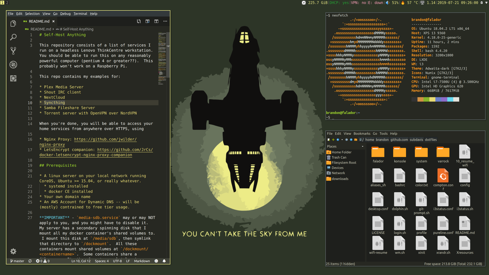

# dotfiles

A collection of my configuration and other dotfiles.


* KDE Ubuntu + 3-gaps
* LXDE Ubuntu + i3-gaps

## Things to install

```bash
sudo apt install i3-wm i3 i3lock
sudo apt install compton
sudo apt install curl
sudo apt install virtualenv
sudo apt install yarn npm
sudo npm install -g n
sudo n lts
sudo apt install dmenu j4-dmenu-desktop
sudo apt install neofetch
sudo apt install mosh
sudo apt install chromium-browser
sudo apt install ukuu

python3 -m pip install --user pipx
python3 -m pipx ensurepath
```

## Other Applications

* [Hub for Git](https://github.com/github/hub/releases)
* [Docker](https://docs.docker.com/install/linux/docker-ce/ubuntu/)
* Spotify (snap)
* Firefox `sudo apt --purge --reinstall install firefox`
* Postman `/opt/Postman`
* VS Code
* [exa](https://the.exa.website/install/linux)
* [bat](https://github.com/sharkdp/bat)
* [delta](https://github.com/dandavison/delta)
* [tmux](https://github.com/tmux/tmux)
* [asdf](https://asdf-vm.com/#/core-manage-asdf-vm)

# Put stuff in its place

```bash
# Run install to place all the dotfiles in the right places
./install.sh
# Run again with root privileges to move system config into place
sudo ./install.sh
```

## Setting DPI elsewhere

https://wiki.archlinux.org/index.php/HiDPI

## Various other setup

```bash
# set gnome-terminal as default emulator
sudo update-alternatives --config x-terminal-emulator

# dconf backup and restore
dconf dump /org/gnome/terminal/ gnome-terminal.conf
dconf load /org/gnome/termina/ < gnome-terminal.conf

# vpn stuff
sudo apt install network-manager-openvpn
nmcli connection import type openvpn file NAME.ovpn
nmcli c modify NAME vpn.user-name "value"
nmcli c up NAME --ask
```

* nvidia docker https://github.com/nvidia/nvidia-container-runtime#docker-engine-setup
* Touchpad Synaptics https://askubuntu.com/questions/773595/how-can-i-disable-touchpad-while-typing-on-ubuntu-16-04-syndaemon-isnt-working
* dconf backup/restore https://github.com/linuxmint/Cinnamon/wiki/Backing-up-and-restoring-your-cinnamon-settings-(dconf)
* https://howchoo.com/g/mdy0ngziogm/the-perfect-almost-touchpad-settings-on-linux-2
